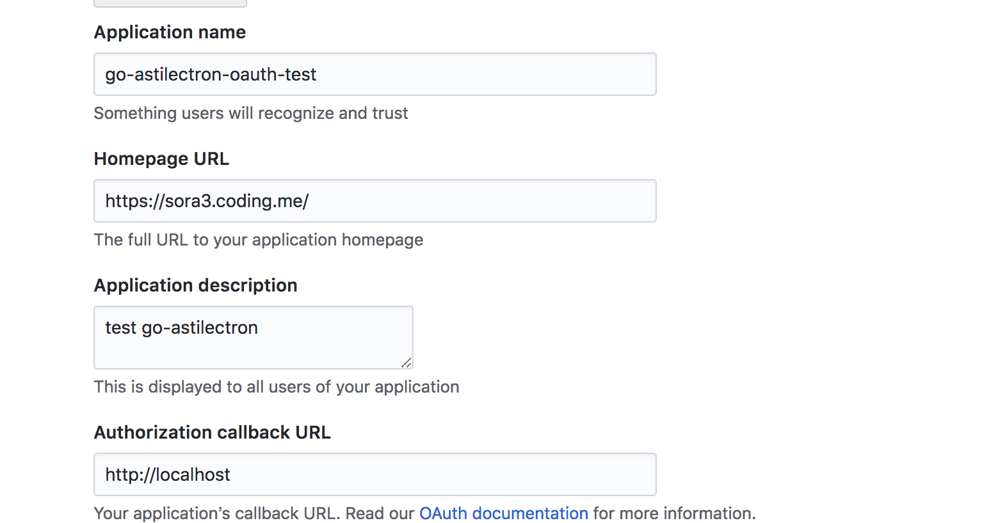

# go-astilectron-oauth-demo


An oauth demo with go-astilectron and vue supported(using github oauth as an example)


References to the issue [How to use OAuth](https://github.com/asticode/go-astilectron/issues/89).


### Usage:

```

$ cd src
$ yarn
$ npm run build
$ cd ..
$ astilectron-bundler -v

```

Notice!!! Make sure that your `go-astilectron-bundler` and the `go-astilectron` is the latest version(include the go/bin/astilectron-bundler)

Here is the result of `go-astilectron-oauth-demo.gif`:


### Use your own github oauth app:

You should create your own github oauth app like this example:




and modify `message.go`:

```

const (
  ClientId                 = "your oauth app client_id"
  ClientSecret             = "your oauth app client_secret"
  RedirectUri              = "http://localhost"
  AuthorizedCodeURL        = "https://github.com/login/oauth/authorize"
  AuthorizedTokenURL       = "https://github.com/login/oauth/access_token"
)

```

Then, run the command:

```
$ astilectron-bundler -v

```


